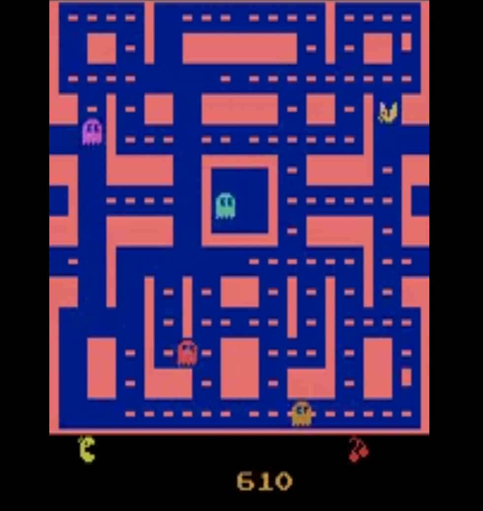
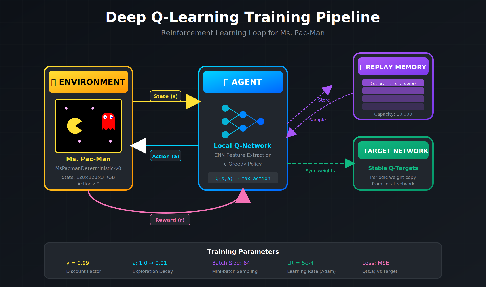
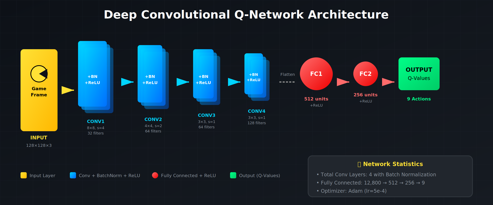
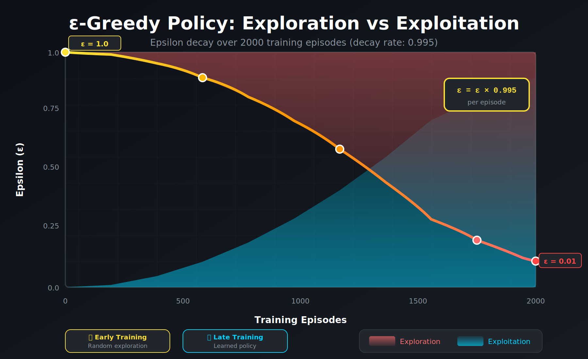
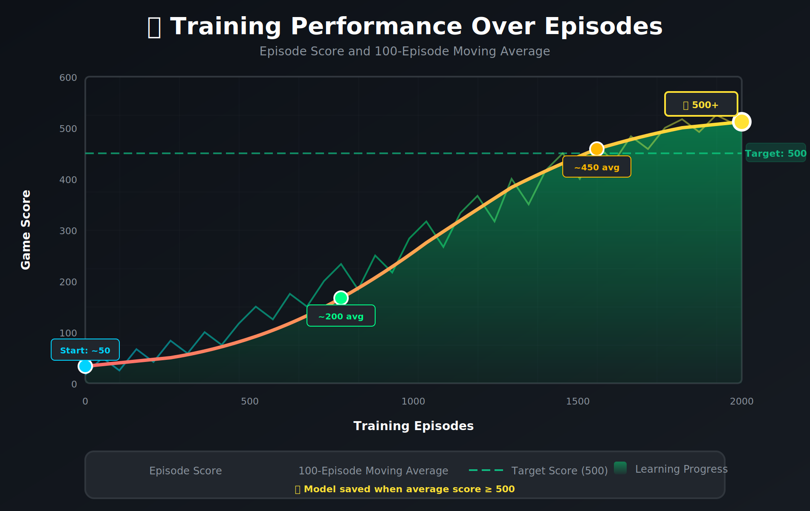

# Deep Convolutional Q-Learning for Pac-Man

This repository contains a **Deep Convolutional Q-Network (DCQN)** implementation using **PyTorch** to train an AI to play **Ms. Pac-Man**. The AI learns by interacting with the game environment through **reinforcement learning**, using **convolutional neural networks (CNNs)** for feature extraction and decision-making.

---

## Showcase Video

[](assets/video/pacman_rec.mp4)

> *Click the thumbnail above to watch the trained agent play Ms. Pac-Man!*

---

## Features

- **Deep Q-Learning (DQN)** with Convolutional Neural Networks (CNNs)
- **Replay Memory Buffer** to stabilize training
- **ε-Greedy Policy** for exploration vs. exploitation
- **Target Q-Network** for more stable learning
- Trained on the **`MsPacmanDeterministic-v0`** environment from Gymnasium

---

## How It Works

### DQN Training Pipeline

The agent learns through a continuous loop of interaction with the game environment:



The pipeline consists of four main components:
1. **Environment** — Ms. Pac-Man game providing states and rewards
2. **Agent** — Neural network making action decisions using ε-greedy policy
3. **Replay Memory** — Buffer storing experiences for stable learning
4. **Target Network** — Provides stable Q-value targets during training

---

## Model Architecture

The Deep Q-Network uses a CNN architecture to process raw game frames and output Q-values for each possible action:



### Network Structure

| Layer | Type | Filters/Units | Kernel | Stride | Output |
|-------|------|---------------|--------|--------|--------|
| Input | RGB Frame | — | — | — | 128×128×3 |
| Conv1 | Conv2D + BN + ReLU | 32 | 8×8 | 4 | 31×31×32 |
| Conv2 | Conv2D + BN + ReLU | 64 | 4×4 | 2 | 14×14×64 |
| Conv3 | Conv2D + BN + ReLU | 64 | 3×3 | 1 | 12×12×64 |
| Conv4 | Conv2D + BN + ReLU | 128 | 3×3 | 1 | 10×10×128 |
| FC1 | Fully Connected + ReLU | 512 | — | — | 512 |
| FC2 | Fully Connected + ReLU | 256 | — | — | 256 |
| Output | Fully Connected | 9 | — | — | Q-values |

---

## Training Dynamics

### Exploration vs. Exploitation

The agent uses an ε-greedy policy that gradually shifts from exploration to exploitation:



- **Early Training (ε ≈ 1.0)**: Agent takes mostly random actions to explore the environment
- **Late Training (ε ≈ 0.01)**: Agent primarily uses learned policy, rarely exploring

### Training Performance

The agent's performance improves as it learns from experience:



Key milestones:
- **Target Score**: 500 (100-episode moving average)
- **Checkpoint**: Model saved automatically when target reached

---

## Installation & Dependencies

Make sure **Python 3.7+** is installed. Then install the required packages:

```bash
pip install gymnasium
pip install "gymnasium[atari, accept-rom-license]"
pip install gymnasium[box2d]
pip install torch torchvision
```

---

## Usage

### Training the Agent

```bash
python train.py
```

Training parameters:
- **Episodes**: 2000
- **Max steps per episode**: 10,000
- **Learning rate**: 5e-4
- **Discount factor (γ)**: 0.99
- **Batch size**: 64
- **Replay buffer size**: 10,000

### Visualizing the Trained Agent

```bash
python visualize.py
```

This will generate a video of the trained agent playing the game.

---

## Project Structure

```
pacman-ai/
├── agent.py          # DQN Agent with replay memory
├── model.py          # CNN architecture definition
├── train.py          # Training loop
├── visualize.py      # Generate gameplay videos
├── checkpoint.pth    # Saved model weights
├── assets/
│   ├── images/
│   │   ├── video_thumb.png
│   │   ├── cnn_architecture.png
│   │   ├── dqn_pipeline.png
│   │   ├── epsilon_decay.png
│   │   └── training_performance.png
│   └── video/
│       └── pacman_rec.mp4
└── README.md
```

---

## Hardware Used for Training

| Component | Specification |
|-----------|--------------|
| **CPU** | AMD Ryzen 7 7800X3D (8 Cores @ 4.20 GHz) |
| **GPU** | NVIDIA GeForce RTX 4070 Ti Super |
| **RAM** | 64 GB DDR5 |

---

## References

- [Playing Atari with Deep Reinforcement Learning](https://arxiv.org/abs/1312.5602) — Mnih et al., 2013
- [Human-level control through deep reinforcement learning](https://www.nature.com/articles/nature14236) — Mnih et al., 2015
- [Gymnasium Documentation](https://gymnasium.farama.org/)

---

## License

This project is open source and available under the MIT License.
